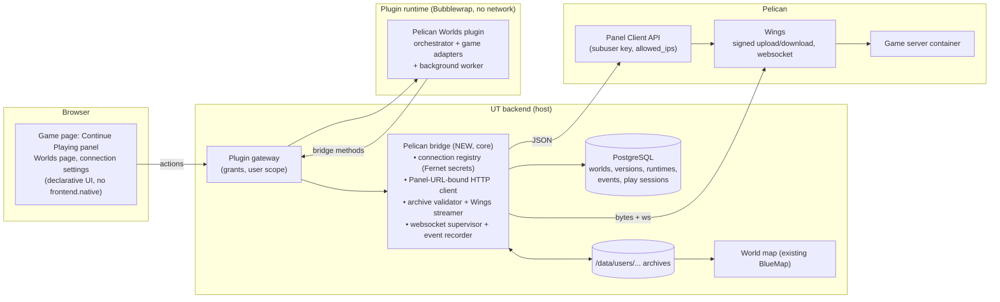

# Proposed architecture

> Unnamed Tracking remembers your games and worlds. Pelican runs them.

This is a proposal backed by the experiments in [experiment-report.md](experiment-report.md). Nothing here is implemented.

## Decisions it builds on

| # | Decision (maintainer) | Evidence |
| --- | --- | --- |
| D1 | Byte transfer and live connections live in **narrow, Pelican-scoped host bridge capabilities**. The UT plugin orchestrates. | Sandbox has no network; `network.request` is JSON GET/POST only; `files/pull` is blocked on LAN (E05) |
| D2 | **Attach to existing servers first**; server creation is a later, admin-opt-in milestone | E01 works, but needs an admin Application key; E06 shows a least-privilege subuser key suffices for everything else |
| D3 | **UT archives are the durable record**; Pelican backups are a short-lived safety net | Server deletion deletes its backups (E08d) |
| D4 | **Custody plus capture-back in milestone 1** | E11 |
| D5 | **Hosted play sessions are separate** from `Game.playtime_seconds` | Steam sync overwrites that column; uptime ≠ playtime (E07) |
| D6 | **Reuse core BlueMap on snapshots**, with an adapter fallback map | Core already renders `world_save` archives; E09 fallback |

## The model in one picture

```text
Game                                   (existing: games)
└── World                              (existing: game_archives kind=world_save)
    ├── Snapshots                      (existing: game_archive_versions + NEW sha256/provenance)
    ├── Hosted runtime                 (NEW: the Pelican server currently bound to this world)
    │   ├── custody state              (in_ut | deploying | on_server | capturing | conflict | detached)
    │   └── runtime events             (NEW: start/stop/crash/deploy/capture, append-only)
    ├── Play sessions                  (NEW: player, start, end, end_reason, runtime, world)
    │   └── position samples           (NEW, optional, retention-limited)
    └── Visualisations                 (existing BlueMap render, keyed by snapshot version)
```

The world belongs to the user's game history. A Pelican server is only a runtime that currently hosts it ([data-model.md](data-model.md)).

## Components and trust boundaries



| Component | Owns | Never does |
| --- | --- | --- |
| **Pelican Worlds plugin** (sandboxed) | Product logic: Continue Playing, Stop & Save and Restore state machines; game-adapter descriptors; per-user consent; UI documents; notifications | Hold credentials, open sockets, touch archive bytes, talk to Pelican directly |
| **Pelican bridge** (UT core, new) | The Pelican credential (encrypted), every Panel and Wings call, streaming archive bytes both ways, generic archive safety validation, the websocket supervisor, writing runtime events and play sessions | Product decisions; game-specific parsing beyond the plugin-supplied descriptor rules |
| **Pelican** (unmodified) | Server lifecycle, files, backups, readiness (egg `done` string), crash restart | Anything UT-specific; no companion plugin needed ([audit](pelican-plugin-audit.md)) |
| **Game adapter** (descriptor shipped in the plugin, interpreted by plugin and bridge) | Paths, identity extraction, readiness and player-line patterns, save/flush commands, compatibility rules, join instructions, map renderer choice | Raw I/O; the bridge performs it on the adapter's behalf |

The bridge lives in the **backend**, not the plugin runtime, because the archive bytes live on the backend data volume and the runtime deliberately has no application-data mounts.

## Bridge capability surface (proposal)

All methods take an installation-scoped, user-scoped grant. Every call is bound to a connection the admin configured (fixed Panel origin), so the bridge is never a general HTTP client.

| Capability | Methods | Risk |
| --- | --- | --- |
| `pelican.servers.read` | `servers.list` (only servers visible to the bridge **and assigned to the calling UT user**), `servers.get` (state from the websocket cache; never the stale REST state), `servers.join_info` | medium |
| `pelican.servers.power` | `servers.power {start|stop|restart|kill}`, `servers.command` (only commands the adapter declares, e.g. `save-off`, `save-all`, `save-on`, `list`, `data get entity * Pos`) | high |
| `pelican.worlds.deploy` | `worlds.deploy {world, version, server}`: validate → stage → swap → start → verify, as one bridge job with progress | high |
| `pelican.worlds.capture` | `worlds.capture {server, world, mode: hot|cold}` → new archive version with provenance | high |
| `pelican.events.subscribe` | Runtime events and player events through the existing `events.poll` | medium |
| `games.worlds.read` / `games.worlds.write` | List worlds and versions with metadata; create a world; attach provenance. **No bytes cross into the sandbox.** | medium / high |

Deliberately absent: arbitrary paths (only the adapter's world root and the `.ut-*` namespace), arbitrary console commands, the Application API (until a creation milestone), SFTP, backup deletion outside UT-created backups, and anything resembling `api.full`.

## Flow 1: connect (admin, once)

1. In Pelican, create a dedicated non-admin account (`ut-bridge`). Each server owner who wants UT to host a world adds that account as a **subuser with the 17 permissions** from E06. That's the whole Pelican-side setup.
2. Create a client key for `ut-bridge` with `allowed_ips` = UT's egress IP (enforced, E06).
3. In UT, enter the Panel URL and key. The bridge stores the key Fernet-encrypted and verifies it with `GET /api/client`, which lists only the servers the bridge was added to.
4. On every health check the bridge lists its own account's API keys and **alerts if any key other than its own exists** (mitigates sibling-key minting, E06).

## Flow 2: attach a world to a server (D2)

A UT user chooses one of the servers assigned to them and binds it to a world. The binding is unique per server (one hosted world per server) and per world (one active runtime per world). The binding records `server_uuid`, `identifier`, allocation and egg variables. A newly created server (later milestone) also gets `external_id = ut-world:<world uuid>`. This gives duplicate protection on the Pelican side (422, E01) and a lookup by world.

**Assigning servers to UT users is an open product question** ([open-questions.md](open-questions.md) Q1). The bridge must never let one UT user act on a server merely because the shared bridge account can see it.

## Flow 3: Continue Playing (custody-aware)

```mermaid
sequenceDiagram
  participant U as User
  participant P as Plugin
  participant B as Bridge
  participant Pn as Panel/Wings
  U->>P: Continue Playing (world W)
  P->>B: runtime(W), custody(W)
  alt custody = on_server and marker matches W
    P->>B: power start
  else custody = in_ut
    P->>B: worlds.deploy(W, latest version V, server S)
    B->>B: validate V (archive safety + adapter identity + size vs disk limit)
    B->>Pn: stop, wait ws offline (timeout → kill only with consent)
    B->>Pn: upload parts → .ut-staging/<job>/ → decompress each → verify listing
    B->>Pn: rename world → .ut-prev/<job>, rename staging/world → world
    B->>Pn: write /.ut-custody.json {W, V, sha256, job}
    B->>Pn: start
  end
  B-->>P: ws status running (or timeout)
  P->>B: identity check (adapter: e.g. `seed` / read level.dat)
  alt identity matches V
    P-->>U: Ready: join 203.0.113.10:25565 (Minecraft 26.1.2)
  else mismatch / never ready / crash loop
    B->>Pn: stop; swap .ut-prev back; custody unchanged
    P-->>U: Failed with reason, previous world restored
  end
```

Each step exists because of an observation:

| Step | Why (evidence) |
| --- | --- |
| Validate before upload | Pelican hides extraction errors behind 500s (E08a); UT holds the bytes and can name the problem. Reject links, traversal, absolute paths, devices, oversize entries. Check the uncompressed total against the server's disk limit (`limits.disk`, Client API). |
| Wait for websocket `offline` | Restore and replace while running is racy (E04); REST state is stale (E02) |
| Upload as parts, under the node's `upload_size` | 100 MB default per file (E12); parts split on file boundaries were verified byte-identical (E12) |
| Extract into staging, then rename | Extraction is not atomic and can leave a partial tree (E08a symlink case) |
| Move the old world aside, don't delete it | Instant rollback path. Asides accumulate (screenshot 03), so retention keeps the newest N. |
| Custody marker | Detects that a server's world isn't the one UT thinks it is (E11) |
| Readiness timeout owned by UT | Pelican waits forever (E08b) |
| Identity check after start | A missing `level.dat` or world directory silently becomes a **new world** that reports `running` (E08b, E10) |
| Join address from `alias ?: ip` of the default allocation | `127.0.0.1` allocations are not joinable (E03) |

## Flow 4: Stop & Save (capture-back, D3 and D4)

1. Adapter pre-capture commands (Minecraft: `save-off`, `save-all`, then wait for `Saved the game`). **Cold** mode stops the server instead.
2. `POST backups` with an adapter-provided `ignored` list that keeps only the world (`*`, `!world`, `!world/**`; negation verified in E04d), so `.ut-*`, asides and runtime binaries are excluded. Wait for the websocket `backup completed` event, which carries sha1 and size (E04).
3. The bridge streams the signed download into a **new `GameArchiveVersion`**, computing sha256. Provenance: runtime, Pelican backup UUID, the play sessions in the custody window, game version, adapter identity. *(The download → archive mechanics are verified (E04, E09b); the UT-side write is the implementation.)*
4. Adapter post-capture (`save-on`). Optionally delete the Pelican backup (needs `backup.delete`, which isn't in the 17) or leave it to the server's backup limit.
5. Custody: `in_ut` if the server was stopped first, otherwise `on_server` with `captured_through`. Redeploying the world elsewhere, or deploying another world onto this server, **requires** a capture after the last run.

**Skip rule:** if no play session happened during custody, a capture can be skipped. Idle runs rewrite files (E11), but there's no progress worth keeping. That makes Track data an input to Preserve.

## Flow 5: Track (bridge websocket supervisor)

* One supervised websocket per running bound server. Refresh credentials on `token expiring` (10-min JWT, 5/min/server credential throttle). Reconnect with backoff. Detect Wings outages by connection failure, not REST (stale 200s, E08b).
* Status changes → runtime events. **Server runtime** = `running → offline` intervals (E07).
* The adapter's line patterns → play sessions: open on join, close on leave. On an **unrequested `offline`** or the `[pelican Daemon] … crashed state` block, close every open session with `end_reason=crash` (no leave lines are printed, E08b). After a bridge restart, reconcile with the adapter's `list` command.
* Optional position sampling (adapter command, for example `data get entity <p> Pos`), only while someone is online, at a low interval, with retention (E07, E09b).
* Optional second source: the official `player-counter` plugin's JSON route, when installed (polling presence, no events).

## Flow 6: Visualise (D6)

* A new captured version feeds the existing core world-map pipeline: BlueMap render keyed by **version**, not just the latest. This needs core fixes: tar.gz extraction with safety filters, the 26.1 world layout in the thumbnail, and Mojang asset egress from the UT backend for BlueMap (E09).
* The adapter's asset-free fallback map (E09/E10: top-block or `minetestmapper`) is used when BlueMap can't run, plus overlays from the play sessions' position samples.
* Each map is associated with (world, version, sessions in the window), as in the E09b association record.

## Flow 7: Restore an older snapshot

Same as Flow 3 with a chosen version. Custody demands a capture of the current server copy first, so nothing is lost. Optionally take a Pelican backup immediately before the swap as the short-lived safety net (D3). Never use `truncate`, and never restore while running (E04).

## Failure handling (from E08)

| Failure | Detection | Safe behaviour |
| --- | --- | --- |
| Bad or revoked key | 401 | Connection unhealthy; no retries; tell the admin |
| Panel down | connection error | Job paused or failed; no state change |
| Wings down | ws connect fails; Panel power and files 500 | Mark the runtime "node unreachable"; don't trust REST state |
| Upload interrupted | client error | Nothing written (E08a); retry the part |
| Archive invalid or hostile | bridge validator (before upload) | Refuse with the precise reason |
| Over disk or upload limits | validator vs `limits.disk` and `upload_size` | Refuse, or split into parts (E12) |
| Never ready | UT timeout per adapter | Kill (with consent), swap back, report the last console lines |
| Crash loop (e.g. newer-version world) | `Aborting automatic restart` daemon line | Stop, swap back, report "world needs a newer server" |
| Wrong world after start | adapter identity check | Stop, swap back, custody unchanged |
| Server deleted | 404 on bind refresh | Runtime `detached`; world and versions untouched (UT is the record) |
| Duplicate binding | unique constraints in UT; `external_id` 422 in Pelican | Refuse |

## Alternatives considered and rejected

| Alternative | Why not |
| --- | --- |
| Use `network.request` as-is | GET/POST JSON only, 8 s, no binary or websocket; also an unbounded SSRF surface |
| Wings `files/pull` from UT | Hard-blocked for LAN addresses (E05); throttled 5/10 min |
| Pelican companion plugin | Not needed for Run/Track/Preserve. Trusted Panel code; can't see console either ([audit](pelican-plugin-audit.md)) |
| Pelican backups as the record | Deleted with the server (E08d); count-limited; restore hazards (E04) |
| `api.full` | Not needed; every required operation maps to a narrow capability |
| SFTP | Password-equivalent credential with whole-tree access; the Client API covers every need |
