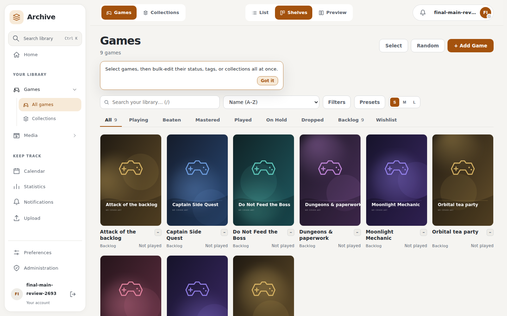
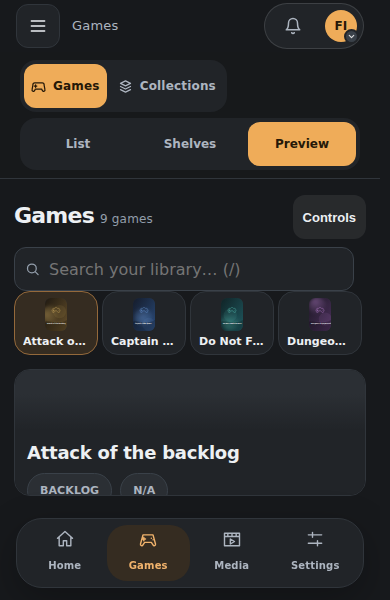
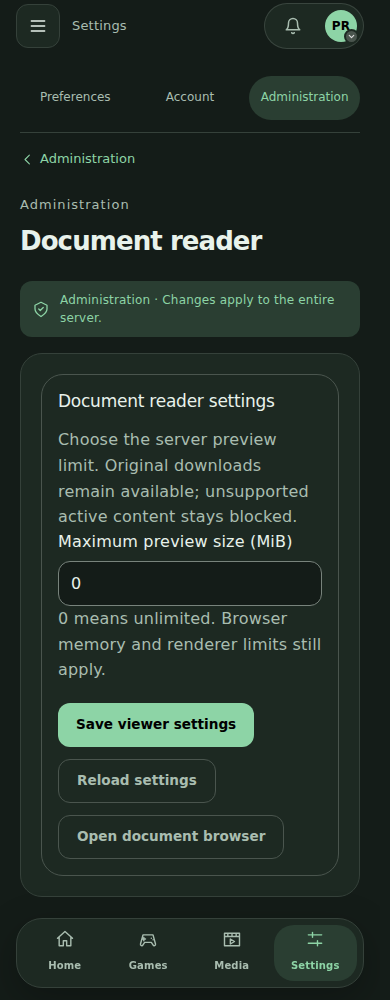

# Final feature-main integration review

The UI branch includes final feature-main `58070fbb` through Plugin Manager
`74823d4`, with native interface integration `31491feb`. Later main bug fixes
are deferred at the user's request. Both published migration histories upgrade
to the generated, schema-neutral head `b57b38daf5b5`.

## Preserved behavior

The new shared game/media detail structure, configurable game-page tabs,
profiles, achievements, notes, file/archive editors and collection tiles are
retained. Game detail now uses focused models and panels instead of one large
component. Native dialogs, semantic colors, permission-controlled plugin slots
and phone S/M/L layouts remain in place.

Metadata repull respects manual locks; library filtering stays on the server;
random-picker hour and genre filters retain their fixes. Trusted real-IP
controls, safe migration recovery, startup JSON responses and redacted operator
logs are integrated. Cards, Sets and Bounties are preserved in the official
Collector's Archive plugin, rather than restored as core routes.

## Accepted production evidence

| Check | Result |
| --- | --- |
| Frontend | 255 tests; full lint, format, Vue types and build pass |
| Source size | 376 frontend files fit the 2,000-line maximum without exceptions |
| Backend | 1,255 tests pass; two existing skips; mypy passes 230 source files |
| Configured Pylint | 9.17/10, passing the existing threshold |
| Production startup | JSON 503 with Retry-After, upgraded database, direct sign-in, JSON 404 and private-log denial pass |
| Installed plugins | All 16 unsigned packages retain identity and recover healthy |
| Native plugin pages | 20 loaded settings layouts and flat Archive placement pass at 320/390/1440/1920 pixels |
| Libraries | 198 Chromium cases across eight widths, all game/media modes and both themes |

The actual app container was built from committed `31491feb`. Runtime source
did not change; its retained production image is `688c1d66`. Current plugins
are the already-accepted companion `f858db6` CI packages. These identities are
recorded in the [startup report](../assets/ui-redevelopment/final-main/production-startup-conformance.json)
and [native report](../assets/ui-redevelopment/final-main/native/native-current-conformance.json).

The [library report](../assets/ui-redevelopment/final-main/layouts/library-layout-conformance.json)
checks distinct phone columns, available-height previews, touch actions,
themed cards and warm Games/Media navigation. Core checks use a separate clean
production fixture, preserving the installed-plugin fixture's data and grants.

## Reproduction and remaining acceptance

The public `tools/check_ui_redevelopment.mjs` harness accepts
`UI_REVIEW_PRODUCTION_ORIGIN` for an actual production frontend and
`UI_REVIEW_HOST_HEAD` for provenance. Use the same backend origin and a
disposable, empty plugin inventory for its core stages. Unknown stages fail
early. `tools/check_native_plugin_ui.mjs` checks installed native integrations;
Collector's Archive retains its separate official-plugin CRUD/layout suite.

Full current detail/save workflows, WebKit review, combined contribution
withdrawal/restore, offline/startup journeys and coordinated PR readiness
remain under acceptance. This milestone is not a final completion statement.
