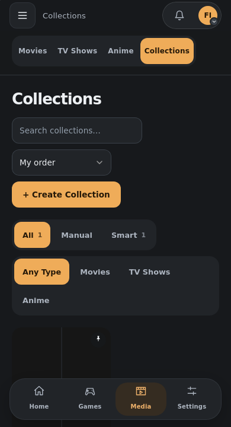
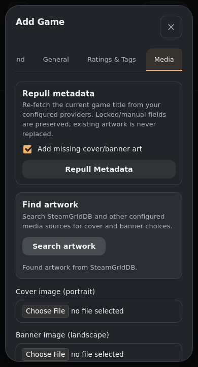
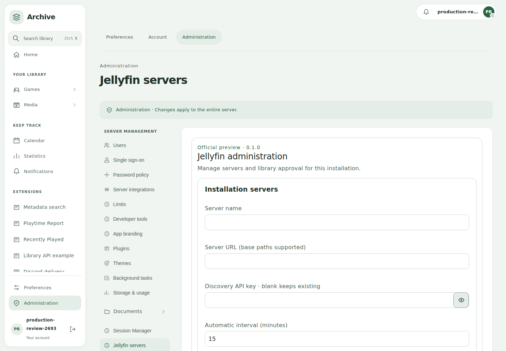

# Final main integration and merge readiness

Main `6244677ae8612e96f6e07be70dd8ed5d491b1257` (#423) is included in
Plugin Manager `9a3964dbc018522a312bec65445b071a111815ae`, which is included in
native UI merge `b76811db6d7859b014a90043c7e4293a123718d2`.
Presentation follow-up `e01f28c3` aligns collection labels and shows artwork
search feedback in the active dialog.

Both required merge trees are clean. Merge host [#305](https://github.com/Rosefall-a/unnamed_tracking_app/pull/305)
into main first, then [#398](https://github.com/Rosefall-a/unnamed_tracking_app/pull/398).
The UI PR remains based on Plugin Manager for review. Host PRs have not been
automatically merged. Normal review and branch protection still apply.

## Preserved features

Pocket navigation/mobile controls and Archive desktop/Home remain intact.
Shared game/media detail models, game-page tabs, profiles, achievements, notes,
file/archive editors, server filtering, collections and metadata locks are retained.
Scoped Game/Media Collections have legacy redirects; shortcuts, tour, Home and
sidebar use their canonical paths. The scoped collection index is explicitly
excluded from game-detail scroll restoration and shortcuts.

Incoming live metadata search excludes the artwork provider; explicit artwork
search uses image sources and reports results/errors in its active native dialog.
Board rows fill available width while preserving measured container sizing and
phone S/M/L columns of 3/2/1. AniList buttons and the temporary Yamtrack anime
import warning are retained.

Revoked API keys are removed from the visible inventory and cannot fall back to
a valid browser cookie. Session audit metadata/last-seen updates and the plugin
management-token boundary are preserved. Existing secret controls, semantic
themes, native dialogs, placement grants and the production JSON/upload fixes
remain in place.

Cards, Sets and Bounties are together in official Collector's Archive. They are
not restored as core routes/tables. The published database histories upgrade to
one generated, schema-neutral head `b57b38daf5b5`.

## Source validation

| Check | Accepted result |
| --- | --- |
| Native UI frontend | 260 tests; full ESLint, Prettier, Vue types and production build |
| UI source size | All 376 files fit the 2,000-line maximum without exceptions |
| Native UI backend | 1,256 tests; two existing skips; mypy over 230 source files |
| Plugin Manager | 1,016 backend tests; two existing skips; mypy over 219 files; 120 frontend tests and full frontend checks |
| Python quality | Touched Python passes Ruff/format; configured Pylint 9.17/10 on both branches |
| Merge relationships | Main is an ancestor of Plugin Manager; Plugin Manager is an ancestor of UI; both merge trees exit 0 |

The full backend run is from `b76811db`; `e01f28c3` changes only three frontend
presentation files, whose complete frontend checks were repeated.

## Actual production evidence

The review apps use committed production source, separate labelled clean-core
and installed-plugin fixtures, and the retained runtime `688c1d66`. Companion
packages are the actual validated unsigned CI distributions from `f858db6`.

| Check | Provenance |
| --- | --- |
| Direct login, startup and retained data/grants | Final app upgrade to `e01f28c3`; all 16 installed plugins retain identities/grants |
| Revoked-key/cookie boundary, JSON 404 and private-log denial | Eight actual API checks at `b76811db` |
| WebKit library layouts | 198 loaded cases at `b76811db`, including all modes, phone densities and touch navigation |
| WebKit guided tour | Required shortcuts/dialogs and touch alternatives at `b76811db` |
| Native settings and flat Archive placement | 20 loaded settings layouts plus placement captures at `b76811db` |
| Scoped collection and metadata/artwork dialogs | 12 WebKit checks at `e01f28c3`; external metadata responses are intercepted fixtures |

Current reports and images are in [merge-readiness evidence](../assets/ui-redevelopment/merge-readiness/README.md).
Metadata UI fixtures validate the compiled frontend and request separation,
not live IGDB/SteamGridDB availability.

Earlier production evidence is preserved with its original source identities
under [final-main](../assets/ui-redevelopment/final-main/production-startup-conformance.json). It includes the
352-case detail review, real save workflows, startup/welcome/search/appearance,
and PWA offline-theme/permission journeys. Those are historical acceptance,
not silently relabelled as final-head reruns.

## Remaining work and coordinated repositories

The user requested efficient merge preparation and an explicit export of residual
work. [Remaining acceptance checks](ui-merge-checklist.md) records unfinished
browser/device verification. The observed existing-session Archive re-enable
problem is [issue #430](https://github.com/Rosefall-a/unnamed_tracking_app/issues/430);
a fresh browser restores its native interface without losing data or grants.

Maintained [plugins #39](https://github.com/Rosefall-a/unnamed_tracking_app_plugins/pull/39),
[template #2](https://github.com/Rosefall-a/plugins-template/pull/2),
[PWA #4](https://github.com/Rosefall-a/unnamed-tracking-mobile-app/pull/4) and
[themes #1](https://github.com/Rosefall-a/unnamed_tracking_app_themes/pull/1)
are ready for review with passing current CI and documented host dependencies.

See the [current open-PR integration review](ui-pr-integration-review.md) for
unrelated branches. The [portable concept gallery](../assets/ui-redevelopment/concepts.html)
and [reference ZIP](../assets/ui-redevelopment/concept-reference.zip) remain
available for future Archive/Pocket/Studio styles.
