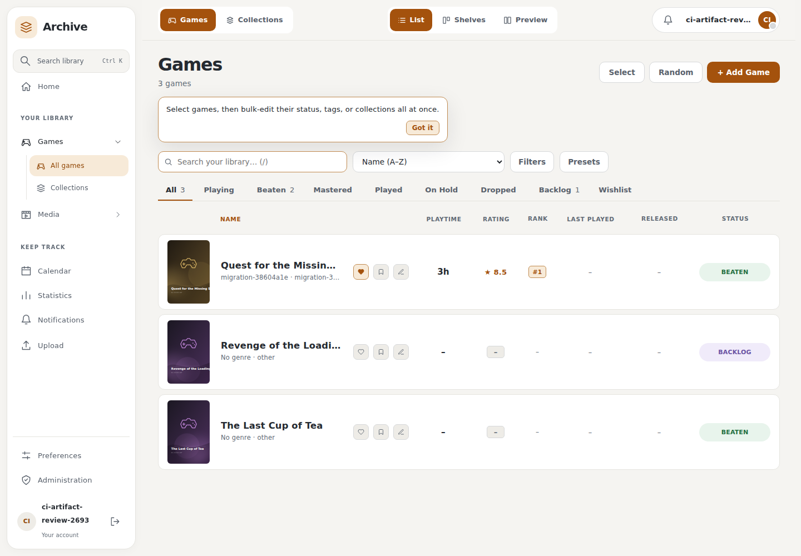
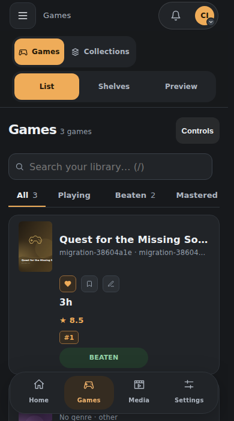
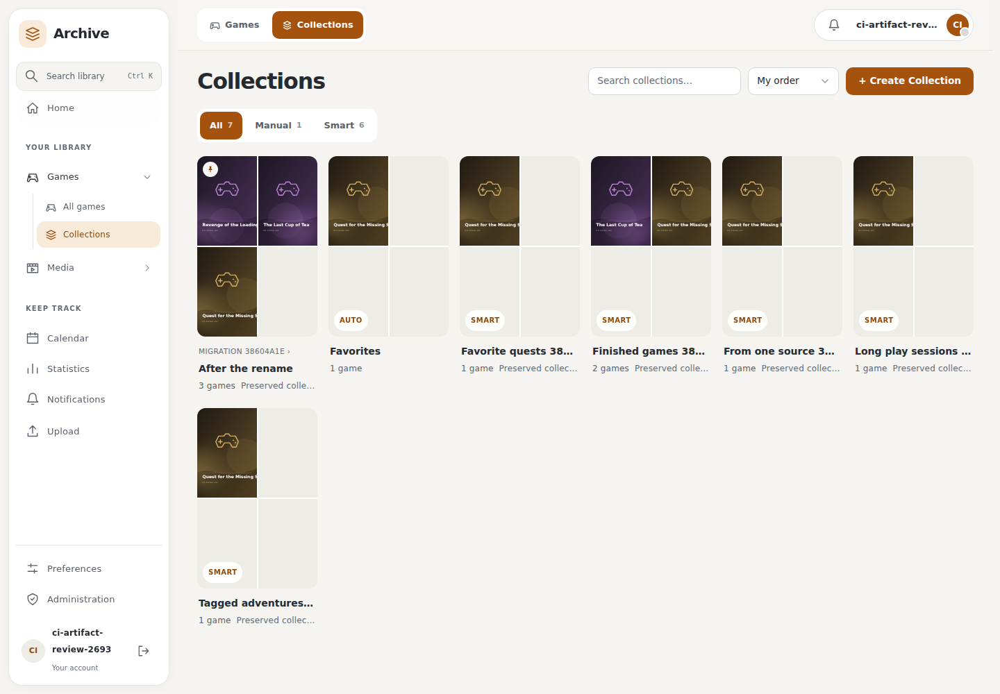
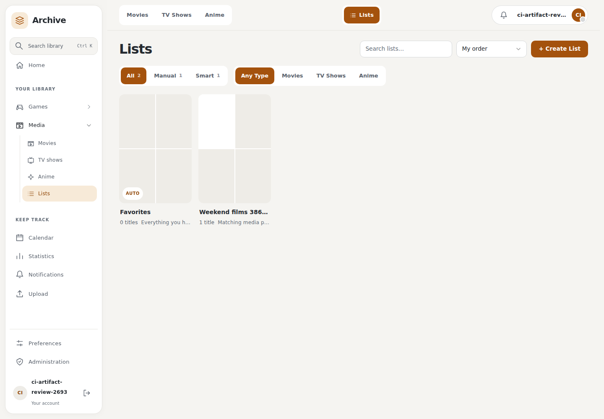
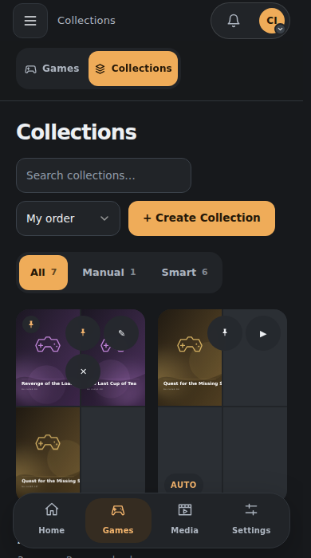
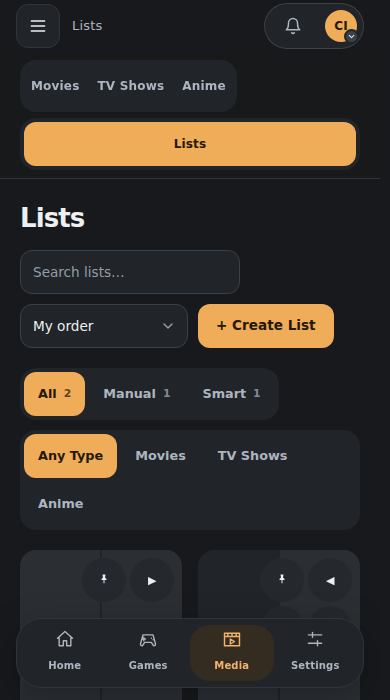

# Games and Media migration review

The redesign preserves main's **Games library redesign (#401)** and **Game
collections redesign (#400)**. Games retains the shared top bar, List/Shelves/
Preview choices, ranked list column, search, status tabs, advanced filters,
sorting, presets, bulk editing and random picker. Collections retain main's
manual and smart rules, metadata, pinning, ordering, selected cover and protected
Favorites collection.

The comparison uses main commit `27ab8aeefd8f38bb6fefe47a3a9b687e5c7b512b`.
All 133 Games Library declarations are accounted for in the extracted
composable. The differences cover background refresh, template refs, remappable
shortcut guards, the requested phone S/M/L columns and inactive virtualizer
handling; filtering has only a TypeScript syntax difference. Collection rules,
metadata and edit helpers match main. This source comparison complements the
browser checks; ancestry alone is not the preservation evidence.

The browser audit creates disposable records through public APIs and exercises
all five smart rules, manual membership, rename, saved game order, selected
cover, pinning, search, protected Favorites and reload persistence. It checks
the three Games views, sorting and search, and compares collection/list headings
and native Add Games/Add Titles pickers at 320, 390, 1440 and 1920 pixels in
light and dark modes. Phone contexts have touch enabled. Card actions remain
at least 44 pixels and fit their cover; native pickers contain focus, close on
Escape and return focus to their opener.

The audit also found and fixed main's numeric Hours rule submission: Vue supplies
a number for a number input, while the stored rule requires a string. Submission
now normalizes it before validation. Media list controls share the collection
card's theme-aware overlays, keyboard-open buttons and touch layout. Blank game
collage cells use the current surface colour.

The sidebar no longer gains a horizontal scrollbar when plugin entries load.
Those rows previously added padding outside their 100% width; they now use
border-box sizing and constrained, wrapping labels. Expanded real plugin folders
were checked at 320, 390, 900 and 1440 pixels.













Run the public acceptance helper through the existing review harness with the
`collections` stage against a disposable backend. It restores preferences and
local collection state and deletes only the records it created:

```sh
UI_REVIEW_USERNAME=review UI_REVIEW_PASSWORD=... \
  node tools/check_ui_redevelopment.mjs /path/to/plugins /path/to/evidence \
  http://localhost:8000 collections
```

The [browser report](../assets/ui-redevelopment/collection-migration-conformance.json)
records this milestone's checks. Final production and remaining extension
checks are tracked separately.
