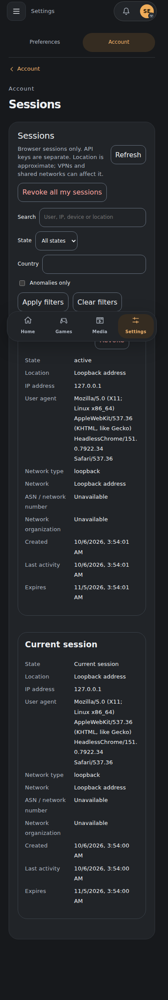
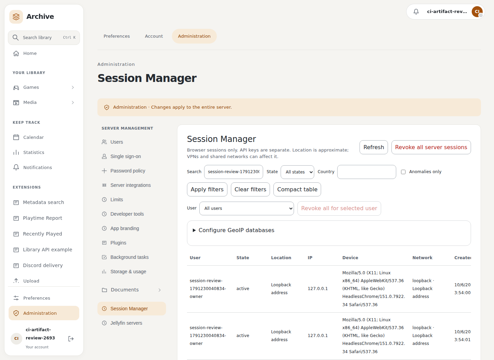
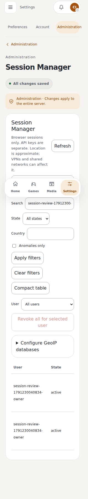
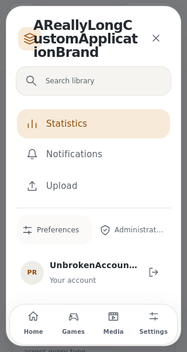
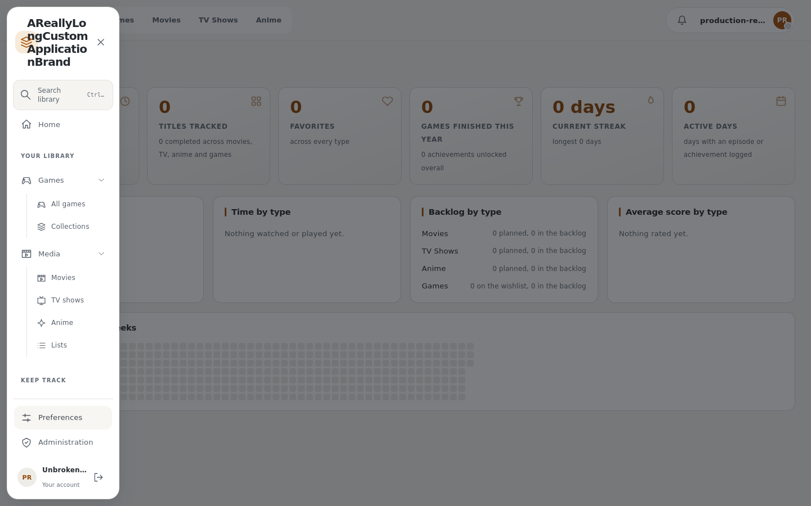
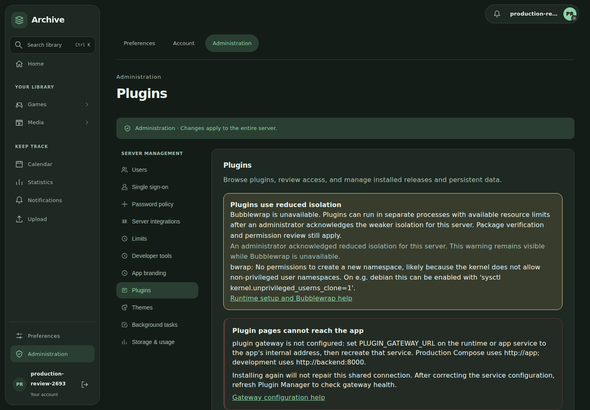
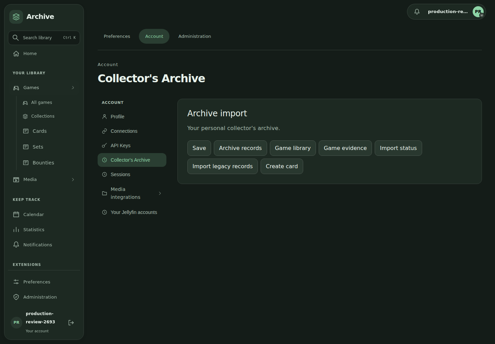

# Native plugin layout review

The current unsigned Jellyfin and theme packages were installed through the
public package review and consent flow in an isolated test server. The native
Document Browser settings came from the validated distribution artifact.

Loaded Jellyfin server and account settings and Document Browser controls were
checked at 320, 390, 1440 and 1920 pixels in light and dark modes. The checks wait
for configuration to load, verify administrator access, and reject horizontal
overflow. Official Jellyfin entries are direct items under **Server management**,
**Account**, and the **Media** sidebar heading.

Purple Blocks demonstrates the granted global stylesheet capability: it squares
the sidebar, account controls, settings navigation, phone tabs and plugin forms.
Switching to Blue Hour releases its shape overrides.

The live Jellyfin check exercised connection, discovery and username/password
sign-in without a manually supplied UUID. Synchronization was disabled, the
media-write permission was denied, and the processed-media count stayed zero.
Test credentials were removed from plugin storage. The public screenshots use
an empty disposable configuration and contain no live server information.

## Permission lifecycle and diagnostics

The installed native test fixture also exercises permission presentation at 390
and 1440 pixels. Active and denied access fold independently, one logical scope
appears once, and icons use the host risk colours. Exact user/device scopes remain
separate. The backend tests cover repeated rejection/reinstatement, historical
duplicate revocation, and concurrent approvals against PostgreSQL.

Diagnostic events show the newest runtime sequence first, including a successful
native configuration load after the owned backend restart. Historical action
errors remain in the buffer. The server's Bubblewrap probe warning appears in
Plugin Manager rather than as a plugin error.

The [permission UI check report](../assets/ui-redevelopment/permission-ui-conformance.json)
identifies the locally built native fixture; it does not claim these captures use
a newly downloaded distribution artifact.

These checks cover the recorded milestones. Final production and remaining
plugin integration checks are tracked separately.

## Authenticated Session Manager and native replacement

The maintained Session Manager now contributes direct **Sessions** and **Session
Manager** entries to Account and Server management. Its controls follow host
theme radii and the administrator user selector has an explicit accessible name.
Phone Settings use the space below the existing header, keep the three areas on
one row, and omit repeated area descriptions inside a selected section. A
shortcut-conflict notice stays below the phone header so navigation remains
available.

The [Session Manager report](../assets/ui-redevelopment/session-native-conformance.json)
records real authenticated owner/admin interactions at 320, 390, 1440 and 1920
pixels. Owner-only reads, clear administrator denial, foreign-session rejection,
filtering, compact tables, cancellation, targeted administrator revocation and
owner single/all revocation pass. Revoked browsers return to login without a
manual refresh; unrelated accounts remain signed in. The captures use a locally
built unsigned working-tree preview, identified by its archive SHA-256, rather
than a newly downloaded CI artifact.

Runtime gateway failures retain bounded, redacted status/detail through the host
action endpoint instead of becoming an unexplained 500. Background extension
refreshes share an in-flight load, preventing repeated polling from discarding
slow but successful contribution discovery. Account changes still invalidate
the previous account's request; explicit lifecycle mutations start a fresh load.

The [same-version native replacement report](../assets/ui-redevelopment/native-same-version-conformance.json)
starts with the downloaded Session Manager CI package, then applies the reviewed
local preview at the same version. An already-open browser reloads its native
realm automatically and requests the replacement JavaScript and CSS using the
installed payload digest. The new accessible selector and host theme radius are
active, and installation identity is retained. This checks the update behavior;
the replacement package is a local preview.

The refreshed core Settings matrix passes all 192 width/theme/role cases,
uniform titles, member administration denial, phone modal focus and overflow
checks. Frontend validation passes all 235 tests, forced type checking, lint,
formatting and the production build. The independently run backend and runtime
suites pass 1,084 tests with two existing skips, and 125 tests respectively;
configured backend Pylint remains 9.11/10.

## Production sidebar access and overflow

Committed production image `47e93aeb` passes all 24 pinned, rail and overlay
layouts in Chromium and WebKit, from 200 × 280 to 1920 × 1050 pixels. The resize
handle stays inside the sidebar, sticky toolbars leave the hamburger accessible,
and short menus scroll to their library, settings and account controls.

The [sidebar report](../assets/ui-redevelopment/sidebar-conformance.json) records
the exact source head and measurements. These are unmodified production checks,
not injected prototype styles. Long brand/account labels are browser-only stress
fixtures; authentication and installed navigation come from the real host.
The reproducible checker is `tools/check_sidebar_layouts.mjs`.

## Current CI packages and gateway repair

Production host/runtime source `dd457b9d` and companion source `34852cf` pass
all 32 install/start cases from the downloaded `unsigned-dist` and
`validated-plugin-distribution` CI artifacts. The
[current package report](../assets/ui-redevelopment/current-ci-package-conformance.json)
records artifact identities, archive digests, versions and running health. These
are actual production packages, with administrator-reviewed reduced isolation,
no `NONBUBBLE_ENV`, and media-writing access withheld.

The [gateway report](../assets/ui-redevelopment/gateway-production-conformance.json)
reproduces missing callback configuration on three actual plugin actions, repairs
it using only the app's explicit callback setting, then restarts the runtime.
Jellyfin, Session Manager and Archive return HTTP 200 after both repair and
restart while the runtime callback environment variable remains omitted.
The missing case returns actionable HTTP 503 guidance; the
[missing-configuration browser report](../assets/ui-redevelopment/native-missing-gateway-conformance.json)
checks the prominent manager warning and errors inside the active native page.

The [native page report](../assets/ui-redevelopment/native-current-ci-conformance.json)
checks twenty loaded Jellyfin, Session Manager and Document Browser settings
pages at 320, 390, 1440 and 1920 pixels in light and dark modes. The public
`tools/check_native_plugin_ui.mjs` checker uses the real authenticated production
host and installed plugin actions.

Archive 0.0.2 contributes Cards, Sets and Bounties directly under Games, with
import directly under Account. The
[current Archive production report](../assets/ui-redevelopment/collector-current-production-conformance.json)
also checks legacy import, owned records, card/set editors, bounty objectives and
idempotent rewards, cross-user denial, global search, Home goals/reminders and
live disable/re-enable behavior. Six loaded native pages pass all four recorded
phone/desktop layouts.

This milestone does not close the subsequently reported appearance-selection
and Session Manager content-width issues; those remain in the progress queue.
