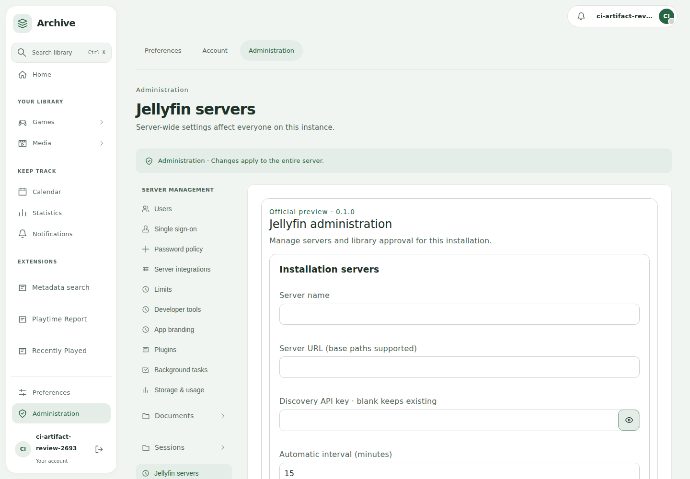
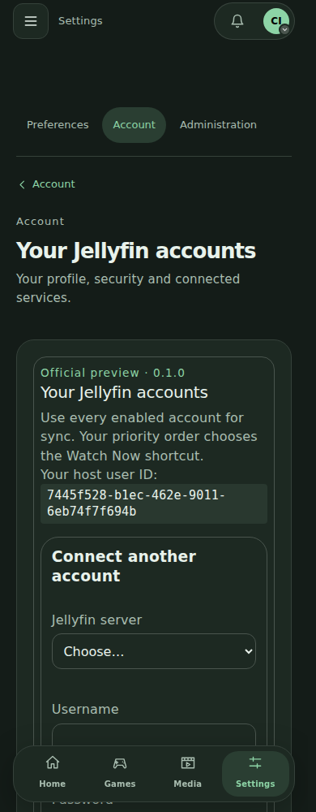
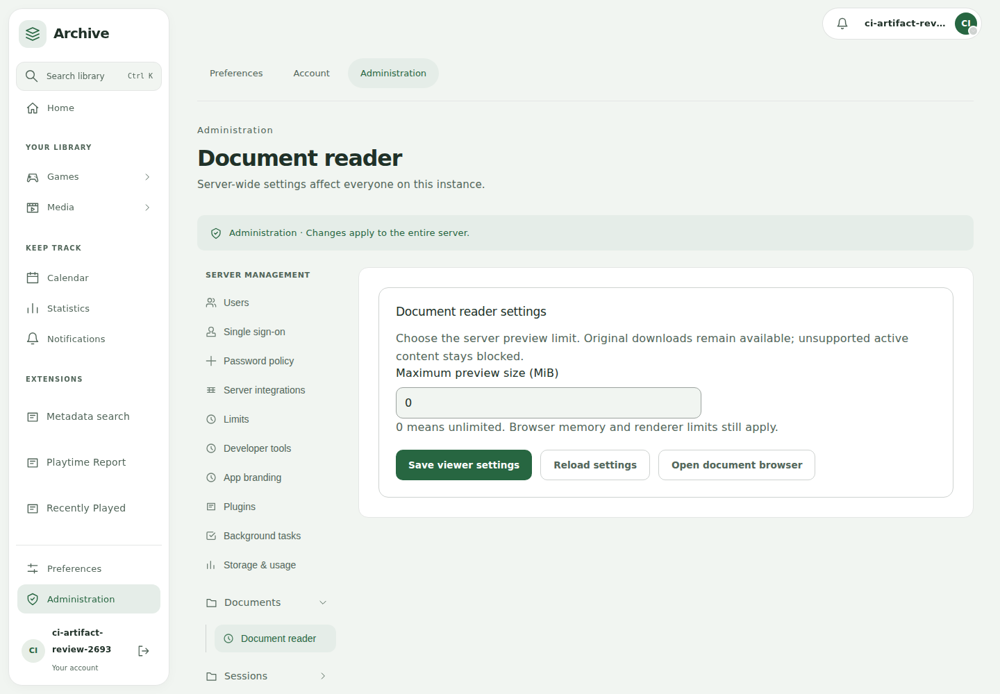
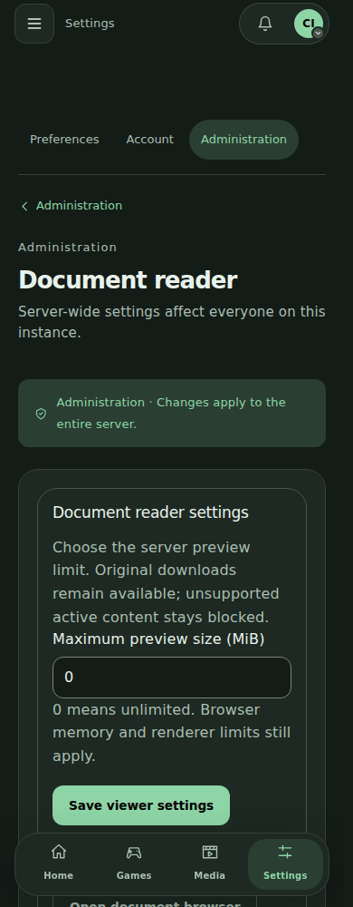
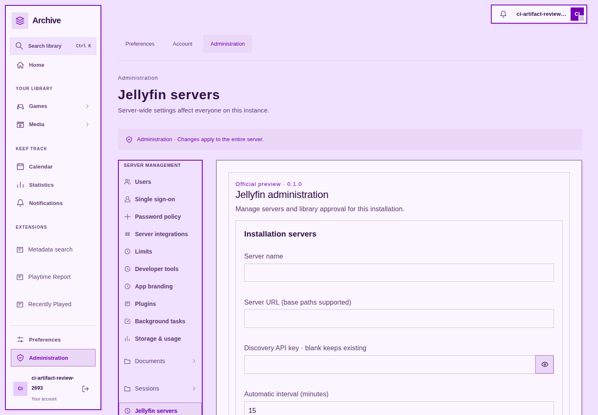
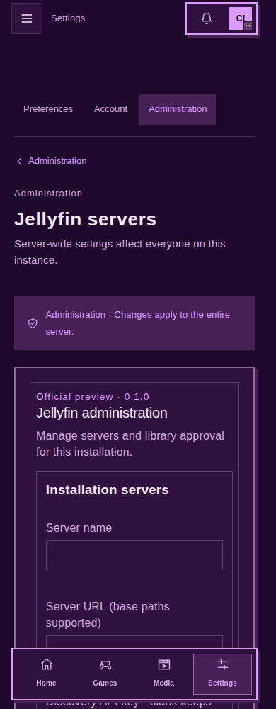
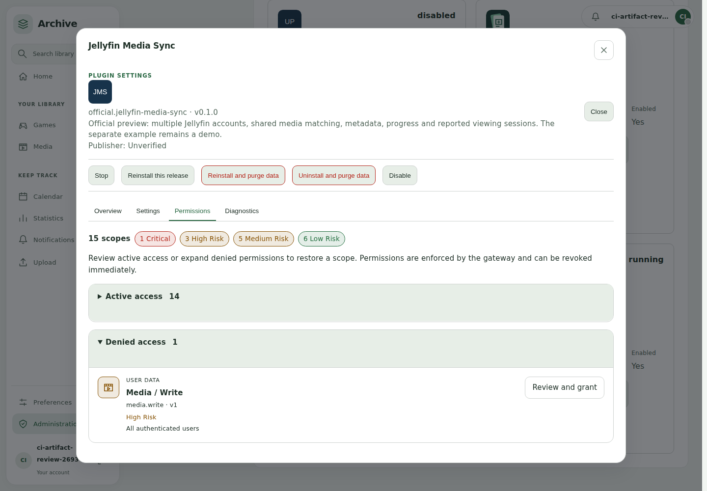
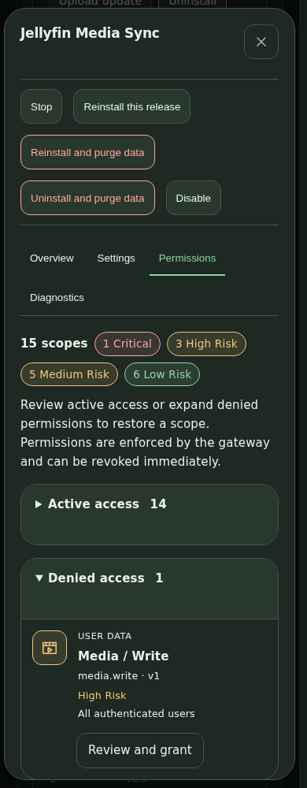
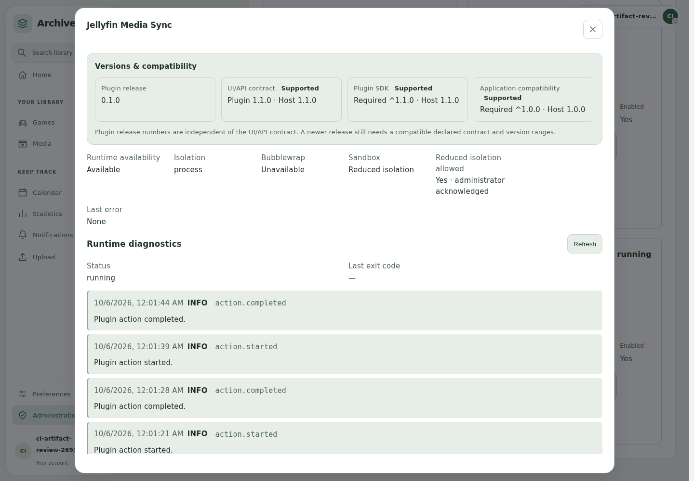
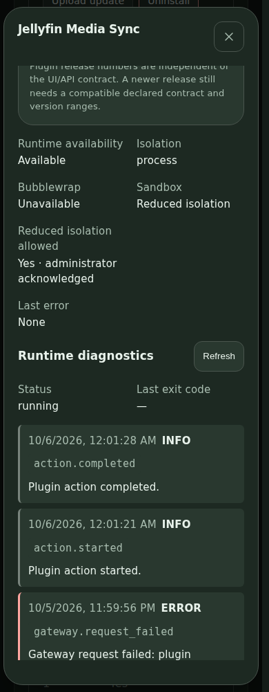

# Native plugin layout review

The current unsigned Jellyfin and theme packages were installed through the
public package review and consent flow in an isolated test server. The native
Document Browser settings came from the validated distribution artifact.

Loaded Jellyfin server and account settings and Document Browser controls were
checked at 320, 390, 1440 and 1920 pixels in light and dark modes. The checks wait
for configuration to load, verify administrator access, and reject horizontal
overflow. Official Jellyfin entries are direct items under **Server management**,
**Account**, and the **Media** sidebar heading.

Purple Blocks demonstrates the granted global stylesheet capability: it squares
the sidebar, account controls, settings navigation, phone tabs and plugin forms.
Switching to Blue Hour releases its shape overrides.

The live Jellyfin check exercised connection, discovery and username/password
sign-in without a manually supplied UUID. Synchronization was disabled, the
media-write permission was denied, and the processed-media count stayed zero.
Test credentials were removed from plugin storage. The public screenshots use
an empty disposable configuration and contain no live server information.

## Permission lifecycle and diagnostics

The installed native test fixture also exercises permission presentation at 390
and 1440 pixels. Active and denied access fold independently, one logical scope
appears once, and icons use the host risk colours. Exact user/device scopes remain
separate. The backend tests cover repeated rejection/reinstatement, historical
duplicate revocation, and concurrent approvals against PostgreSQL.

Diagnostic events show the newest runtime sequence first, including a successful
native configuration load after the owned backend restart. Historical action
errors remain in the buffer. The server's Bubblewrap probe warning appears in
Plugin Manager rather than as a plugin error.

The [permission UI check report](../assets/ui-redevelopment/permission-ui-conformance.json)
identifies the locally built native fixture; it does not claim these captures use
a newly downloaded distribution artifact.

These checks cover the recorded milestones. Final production and remaining
plugin integration checks are tracked separately.
