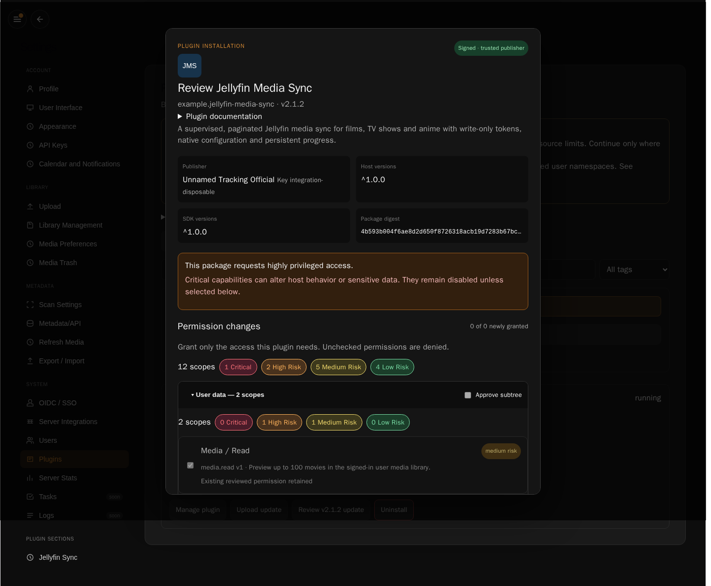

# Plugin repository lifecycle verification

Verified on 2 October 2026 against host `plugin-manager` (baseline `0cd0ced0`)
and plugin repository `main` (`27a2c7f`), with the integration fixes described here.
The repeatable runner is documented in [Plugin integration validation](plugin-validation.md).

## Failures found and corrected

The browser sent source metadata as `type`, whereas the remote API accepts
`source_type`. Catalogue installs therefore became fixed-URL installs and missed
later catalogue updates. Spreading stored source metadata also allowed the old
URL to replace the selected new release URL. All four remote preview/install/update
requests now serialize provenance explicitly and preserve the selected URL.

GitHub browser acceptance also exposed an installer timing bug: after the consent
dialog closed, a second installation preview could open while contribution refresh
still kept the first installation busy. Cancelling the duplicate then did nothing.
The launcher and preview actions now remain disabled until installation finishes;
acceptance holds a real contribution request to reproduce this timing deterministically.

The official builder stores tags, release notes and release-specific update policy
in integrity-protected `distribution.json`. The host previously read only manifest
defaults, losing this information from previews and installed inventory. The host
now validates and consumes that metadata, and automatic activation checks the
packaged policy as well as the advertised policy. Catalogue acquisitions validate
advertised identity, version, payload digest and archive hash on every remote
preview/install/update path. Old catalogues without optional hashes remain supported.

The plugin CI's frozen host checkout and author documentation described an older
host without the Plugin Manager lifecycle. CI now follows `plugin-manager` and
the guides distinguish the frozen v1 schema from current host behavior. Historical
audits remain dated snapshots.

## Acceptance evidence

The acceptance uses the real host, PostgreSQL, authenticated runtime HTTP, Python
workers, gateway authorization and official builder. A disposable signing identity
is trusted only inside the temporary environment. Jellyfin performs an actual HTTP
sync against a deterministic local Jellyfin server and stores credentials, progress
and configuration through public APIs.

| Requested area | Verified behavior |
| --- | --- |
| Distribution | Live official catalogue and all four current package URLs; payload/archive hashes, versions, trusted signatures, README, tags and update policy; the downloaded official Jellyfin package installs and runs healthy before the synthetic sequence; retired package histories remain immutable but are not current catalogue entries |
| Install | Rendered discovery, tag filtering, detail/README, host risk bubbles and scope counts, explicit approval, running/healthy worker and native Jellyfin page; duplicate installation exposes update/reinstall/replace/cancel |
| Persistent data | Configuration, secret/progress storage bytes and installation identity survive host/runtime restart, disable/enable, preserving reinstall, update, rollback and failed update; confirmed purge resets owned data and uninstall removes it |
| Permissions | Plugin declarations are classified by host; revocation denies real actions; explicit regrant restores access; newly requested scope stages an update while the old version runs, then approved staged activation succeeds |
| Updates | A signed patch appears in Updates Available and installs directly from that UI; integrity/version verified; data survives; a false-policy release stays staged and a subsequent true-policy release installs automatically |
| Automatic failure | A signed release deliberately fails worker startup; activation is attempted and failure restores the previous version, data and running state; error and administrator notification recorded |
| Rollback | Retained previous package activates manually without data purge; configured retention of two versions is enforced and changing retention to one prunes history |
| Catalogues | Official and separate third-party catalogues enabled together; All contains unique entries from both and one installed identity for overlapping plugin IDs; plugin-provided tags filter rendered rows |
| Runtime | Real binary/namespace probe; reduced-isolation runtime health and UI accurately expose process execution and unavailable sandbox isolation; runtime suite exercises usable and unsupported capability policy |
| Remote API | Five individually scoped management tokens exercised against a 5-by-5 route authorization matrix; unrelated identity, game and appearance APIs deny those tokens; tokens revoked after use |
| Documentation | Current creation/scopes/storage/package/release/policy/catalogue instructions reviewed; obsolete current-host claims corrected; strict documentation build passes |
| CI | Complete backend, runtime, frontend, plugin Python/JavaScript/browser, packaging/history, current-host contract and cross-repository browser acceptance checks run; repeatable acceptance added to CI |

## Environment limits

The direct update review below was captured from the real built frontend during
acceptance. The publisher key belongs only to the disposable test environment.

This environment cannot create Bubblewrap namespaces. The acceptance deliberately
enables reduced isolation in a disposable container and verifies that it is reported
accurately. Successful operating-system isolation is covered by runtime policy tests,
not claimed as a successful real sandbox run here.

Official catalogue/package downloads use actual public URLs. Only acquisition of
the synthetic update-sequence catalogue/packages is routed to local files generated
by the official builder. The runner does not publish fake releases, expose a signing
secret or mutate the official catalogue. GitHub publication and release-history
validation remain the plugin repository's separate signed release workflow.
