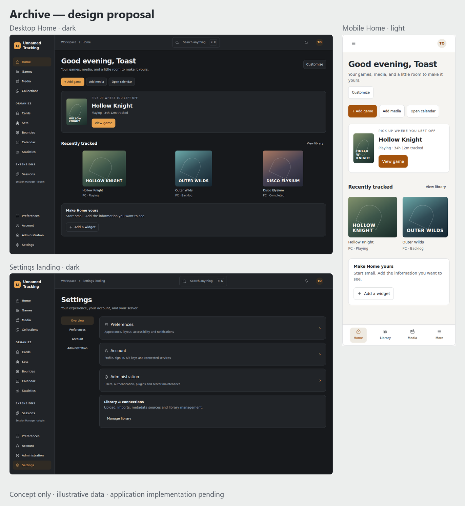
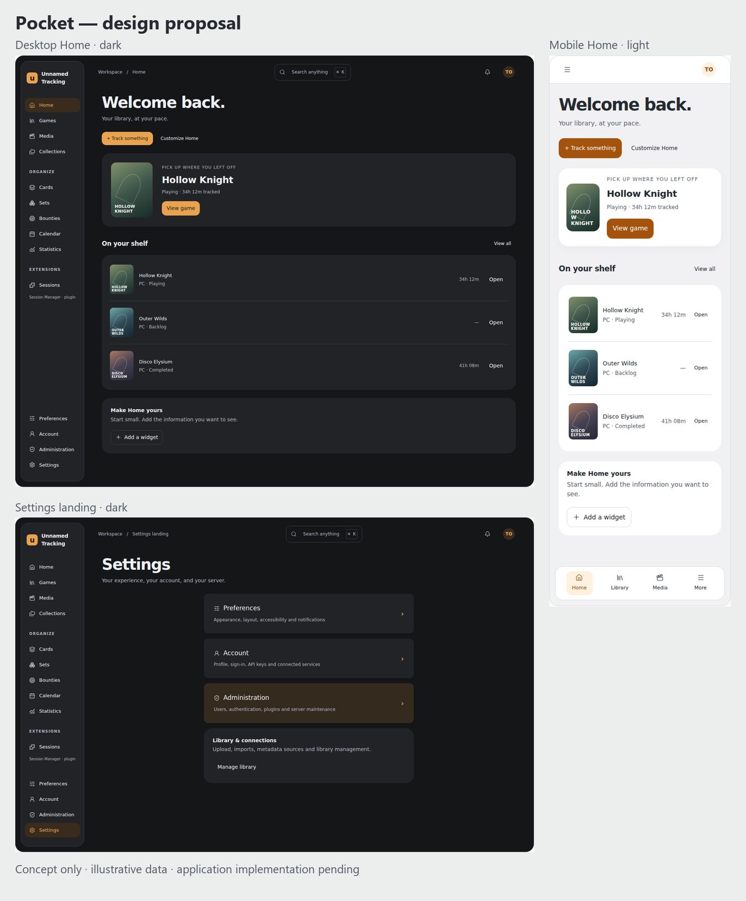
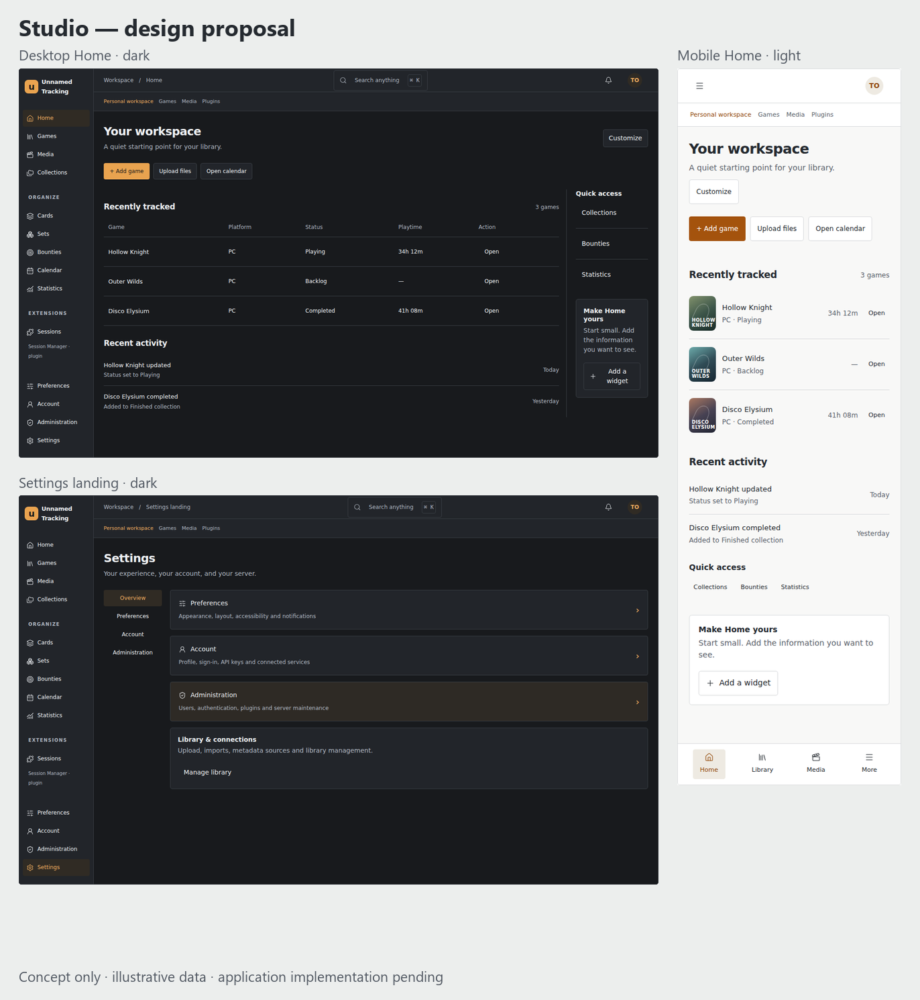

# UI redevelopment: audit and design checkpoint

Status: **design selection pending**. The application still uses the reconciled v1.0 UI contract. The concepts below are interactive proposals with illustrative data, not implemented product workflows. No v1.1 compatibility is claimed.

## Baseline

`plugin-manager` was reconciled with `main` at `54056e01` on 2026-10-04. The reconciliation preserves both branches' authentication, startup, library, settings and plugin features. Host/port-scoped browser cookies now work through plugin actions, document routes, management authentication and the session gateway. Negative HTTP tests reject legacy and wrong-host cookies.

The independently published migration heads converge at `b8c7d6e5f403`. Upgrades from each previous head, fresh migration, and adoption of an existing database pass. Plugin migrations use idempotent helpers during legacy adoption; published revision identities remain intact. Future migrations start from the single current head.

Local validation:

| Check | Result |
| --- | --- |
| Backend suite, PostgreSQL 16 | 815 passed; two opt-in repository tests subsequently run separately and passed |
| Backend type check | 202 source files pass |
| Backend Pylint | 9.26/10; CI threshold 9.0 |
| Plugin runtime suite | 84 passed |
| Companion repository suite | 214 passed |
| Frontend | 19 test files / 106 tests; type check, ESLint, Prettier and production build pass |
| Wiki | Strict build passes |
| Packages | Build, distribution/source check, signature/package verification, schema validation and host contract pass across 12 maintained sources, including unreleased previews |
| Real lifecycle + browser | Discovery, consent, install, native UI, inventory during outage, sync, secrets, restart, disable/enable, retaining reinstall, update, rollback, permission staging/denial, failed-worker recovery, token confinement, purge and uninstall pass |

The real lifecycle run uses **reduced isolation**, explicitly configured by the existing acceptance harness. It does not prove strict production isolation or the eventual v1.1 per-plugin responsive matrix. Runtime isolation tests and a Linux Bubblewrap launch probe pass separately. Existing deprecation/cache warnings are recorded; Windows psycopg lacks libpq, so PostgreSQL/backend acceptance ran under WSL Ubuntu.

## Current architecture and implications

| Area | Current implementation | Redevelopment consequence |
| --- | --- | --- |
| Frontend | Vue 3, TypeScript, Vite, lazy Vue Router views, shared reactive state modules | Extend the existing component/state architecture; do not introduce a second app or framework |
| Shell | Sidebar supports overlay/pinned/rail, remembered locally, resizable 200–440 px; default overlay | Use deliberate desktop defaults and touch navigation; preserve remembered modes without mobile content offsets |
| Product identity | Orange/graphite accents, media artwork, mixed Archive/Unnamed Tracking labels | Establish one configurable brand; keep orange identity with usable light/dark contrast |
| Styling | Dark-only global stylesheet plus partial `--ui-*` tokens and per-component hardcoded colors | Introduce semantic theme tokens for surfaces, type, spacing, density, radius, elevation and motion, then replace styles incrementally |
| Existing primitives | AppDialog, segmented tabs/controls, skeletons, tables, forms and upload views | Consolidate proven primitives rather than adding duplicate component systems |
| Preferences | Server-backed appearance/media preferences plus device-local interface preferences | Explicitly distinguish per-account settings from device-specific shell choices and server-wide branding |
| Home | Rich shelves/hero/actions with `home.replace` and `home.after-widgets` | Start minimal; add persisted user-selected widgets and a public widget lifecycle/API |
| Settings | Consolidated sections/query aliases; Account, Preferences, Library and System groups; plugin additions | Separate Preferences/Account/Administration with useful Library/Connections sections. No unfinished administrative controls. Render administration only for admins |
| Navigation | Games, collections, cards, sets, bounties; movies, TV, anime, lists; calendar, stats, notifications | Preserve the complete product inventory. Sessions/documents are plugin/context features, not invented core domains |
| Routing | Existing library/detail paths, `/plugins/:pluginId/*`, `/settings?section=…`, upload/inbox redirects | Maintain usable deep links and aliases, update internal/plugin/wiki links together |
| Shortcuts | Command palette, `?`, `/`, `n`, j/k/arrows, Enter, a–z and Escape; calendar/detail-specific handlers | Preserve editable-field guards, improve palette coverage and focus return, document conflict handling and touch equivalents |
| Plugin boundary | Capability-filtered active contributions; settings/main/admin navigation, routes, contextual actions, extension slots and replacements | Keep grants and health/compatibility checks authoritative. Disabled/uninstalled plugins must disappear immediately |
| UI hosts | Declarative UI, sandboxed iframe bridge and explicitly privileged native Vue modules | Provide documented responsive/theme APIs for each mode without widening iframe or native permissions |
| Compatibility | Manifest SDK ranges often `^1.0.0`; UI schema `v1`; plugin release version is independent | An SDK bump alone is insufficient: explicitly identify contract v1.0 vs v1.1, reject unmigrated UI against v1.1, and test newly declared support |

Existing slots include `app.global`, `home.replace`, `home.after-widgets`, `game.overview.after-header`, `game.documents.actions` and `media.detail.after-header`. Replacements must retain a working host fallback on denial, failure or deactivation. Native UI exposes Vue registration/cleanup plus host navigation/actions/settings/dialog functions; it has privileged DOM access and must retain explicit consent.

## Companion plugin inventory

Audit source: `unnamed_tracking_app_plugins` main at `9a88160b79c73ee918bc4b5bb21d4b781ae175f8`. Read manifests, entrypoints, native/sandbox assets and related tests/docs. Package release numbers such as 1.1.0 or 2.0.0 do **not** mean the new host UI contract is supported.

| Maintained source | UI/integration to migrate and verify |
| --- | --- |
| UI/API | Declarative page, action, settings, main navigation, games read |
| Playtime Report | User-scoped library report, declarative page/settings, persisted data |
| Recently Played Notifier | Games read, user notifications, settings and scheduled behavior |
| Metadata Curator | Metadata provider/search, normalized state and settings |
| Discord Delivery Provider | Delivery provider registration, notification coordination, secrets and restricted egress |
| UI Playground | Multiple sandboxed Vue pages, bridge, private storage and announcements |
| Help Button | Native routes, navigation, global overlay, dialog, Home/page replacement, contextual and settings contributions, cleanup |
| Jellyfin example | Native page/settings, identity mapping, secrets, media sync/history and event polling |
| Scoped Document Viewer | Sandboxed document reader, contextual actions, MIME/ownership confinement and mobile reader |
| Self-Service Session Manager | Native account/admin pages, scoped sessions, confirm-before-revoke and maps/privacy |
| Official Jellyfin preview | Separate identity and official signing boundary; media/plugin page integration |
| Official PWA preview | Install metadata, icons, host service worker, offline reconnect and branding propagation |

The two official previews remain unreleased pending their protected signing identity. Ten example sources remain maintained; stale host documentation incorrectly describing six as retired was corrected during reconciliation. No maintained standalone theme plugin currently exists, and the new Home widget demonstration does not exist yet. Both are explicit future coverage rather than fabricated compatibility evidence.

## Concepts

Use the [interactive concept gallery](../assets/ui-redevelopment/concepts.html). These share feature scope but differ in layout and interaction.

| Direction | Desktop | Mobile | Tradeoff |
| --- | --- | --- | --- |
| Archive | Labelled persistent sidebar; balanced reading column; restrained cards; split settings | Bottom navigation plus grouped full-screen menu; stacked rows and contextual actions | Strong continuity with orange/graphite identity and clear library hierarchy |
| Pocket | Floating navigation pane; generous type; inset preference groups; editorial Home | Large touch rows; rounded cards; compact tab bar; settings as drill-down groups | Comfortable and approachable; lower information density |
| Studio | Compact sidebar plus workspace navigation; activity/list Home; table-based library | Dense but readable lists, explicit action rows and grouped menu | Efficient for larger libraries; more utilitarian than artwork-led |

Each includes desktop Home, mobile Home, desktop navigation, mobile navigation, settings landing, preferences, account, administration, a library page and a plugin page/widget. Gallery controls switch theme, viewport and user role. Widget figures and account/session data are illustrative. There is no video, thumbnail or media demo capture in this evidence.

Concept browser verification covers **480 screen/theme/width combinations**: three directions × ten screens × two themes × eight widths (320, 390, 430, 768, 1024, 1440, 1920 and 2560 px). No JavaScript errors or product-boundary overflows were found. Local interactions for theme switching, library filtering, widget selection, profile feedback and member/admin visibility pass. Captures were inspected visually. This verifies the proposals; it does not substitute for testing the eventual application.

Reproduce with Node 22+ and the companion repository's installed Playwright/Chromium:

```sh
node tools/check_ui_concepts.mjs /path/to/unnamed_tracking_app_plugins
```

The default evidence directory is `.validation/ui-concepts`. The gallery's editable fragment is `wiki/docs/assets/ui-redevelopment/concept-source.html`; `concepts.html` is its standalone preview with local carousel controls. No production route loads these files.







## Implementation sequence after selection

1. Establish semantic tokens, layout primitives, accessible dialog/drawer/menu focus behavior and a reduced-motion policy. Keep a small component preview harness for future assembly work.
2. Add minimal storage for account appearance/Home preferences and admin branding/logo/favicon metadata, with validation and clear scope. Define theme metadata and granted theme participation; no marketplace is required.
3. Replace the shell and navigation, including persisted desktop modes, touch bottom navigation/drawer, tablet transitions and plugin-aware groups. Preserve deep links and keyboard access.
4. Rebuild Settings and Home; provide per-user widget selection/order with explicit touch alternatives to drag. Account and server settings have different explanatory copy and permissions.
5. Introduce the **v1.1.0** UI contract with explicit v1.0-only handling. Publish tokens, responsive primitives, widget registration/configuration/cleanup, capability-gated navigation/theme APIs and migration guidance.
6. Migrate maintained plugins in the companion repository, including actual mobile/native/sandbox UI work, and add a useful widget plus an **Embedded media demo widget**. Test embedded playback without recording its contents. Do not edit published packages or pretend old ranges imply migration.
7. Migrate all major content views, forms, uploads, documents, notifications and contextual actions. Replace obsolete UI only when its functionality has a proven replacement.
8. Complete the realistic plugin lifecycle matrix, ordinary/admin permission checks, routes/shortcuts/accessibility checks, and visual workflow checks at phone/tablet/laptop/desktop/ultrawide widths in light/dark/custom themes. Update implementation wiki pages only as capabilities land.

## Review checkpoint

Choose a direction (or concrete combination) before applying its visual structure to the application. The Draft PR remains a living record and targets `plugin-manager`. The gallery and concept captures are proposals; actual v1.1 implementation, plugin migration, final responsive proof and final acceptance remain pending.
